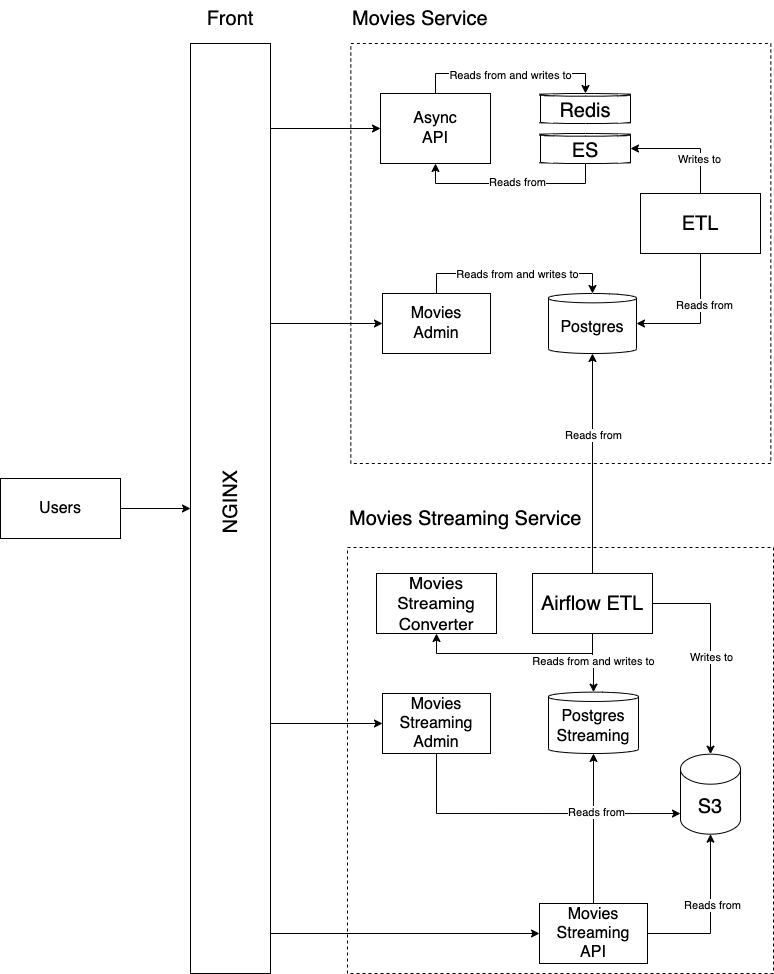

Это описание финального проекта яндекс практикума (курс мидл питон разработчик). Фнальный проект выполнялся в группе. 

Также я добавил свою упрощенную реализацию финального проекта в которой реализован текстовый поиск в базе с использование ЯНДЕКС АЛИСЫ. 
Описание моей реализации тут 
[Click here](README_MY)

# Online Movies

## Presentation

[Click here](docs/presentation)


## Architecture



## Running

### Development

Uses the default Django development server.

1. Rename *.env.dev.example* and *.env.streaming.dev.example* to *.env.dev* and *.env.streaming.dev* in envs directory. 
2. Update the environment variables in the *.env.dev* and *.env.streaming.dev* file.
3. Build the images and run the containers:

    ```sh
    $ docker-compose -f docker-compose.yml -f docker-compose.dev.yml up --build
    ```

    Test it out at [http://localhost:8000](http://localhost:8000). The "movies_admin" and "movies_etl" folder is mounted into the container and your code changes apply automatically.
4. On first run, after initialising the database to fill the database with data:

   ```sh
   $ docker exec movies_admin python utils/sqlite_to_postgres/load_data.py
   ```
5. On first run, after initialising the minio create a test bucket in the minio.

### Production

Uses gunicorn + nginx.

1. Rename *.env.prod.example* and *.env.streaming.prod.example* to *.env.prod* and *.env.streaming.prod*. 
2. Update the environment variables in the *.env.prod* and *.env.streaming.prod* file.
3. Build the images and run the containers:

    ```sh
    $ docker-compose -f docker-compose.yml -f docker-compose.prod.yml up --build
    ```

    Test it out at [http://localhost:1337](http://localhost:1337). No mounted folders. To apply changes, the image must be re-built.

4. On first run, after initialising the database to fill the database with data:

   ```sh
   $ docker exec movies_admin python utils/sqlite_to_postgres/load_data.py
   ```

## Technologies used

- The application runs as a WSGI/ASGI server.
- To render [static files](https://nginx.org/ru/docs/beginners_guide.html#static), **Nginx is used.
- Virtualization is done with **Docker.**.

## Main system components

1. **Server WSGI/ASGI** - server running the application.
2. **Nginx** - proxy server which is an entry point for web application.
3. **PostgreSQL** - relational data storage. 
4. **ETL** - elasticsearch.
5. **FFmpeg** - FFmpeg.
6. **Airflow ETL** - airflow.

## Project requirements

1. The application must be run via WSGI/ASGI.
2. All system components are hosted in Docker.
3. Static files are served by Nginx.

## Recommendations for the project

1. To work with WSGI/ASGI server the database uses a special user.
2. Use docker compose to communicate between containers.
